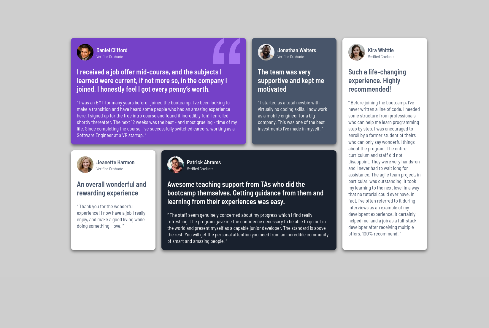

## Table of contents

- [Overview](#overview)
  - [The challenge](#the-challenge)
  - [Screenshot](#screenshot)
  - [Links](#links)
  - [Built with](#built-with)
  - [What I learned](#what-i-learned)

## Overview

### The challenge

Users should be able to:

- View the optimal layout for the site depending on their device's screen size

### Screenshot

### Links

- Live Site URL: [Grid-training-live](https://grid-training-session.netlify.app)

### Built with

- Semantic HTML5 markup
- CSS custom properties
- CSS Grid
- CSS Flex box

### What I learned

Learned more about grid making and absolute positioning, it was a quick hop-on, and took me around an hour or less, so proud, that I can tackle such scale projects with ease almost without the help of friendly AI, so I feel proud, can`t wait to tackle JS projects!
